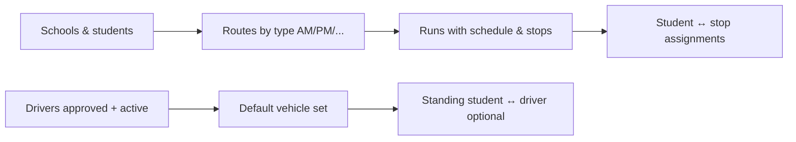
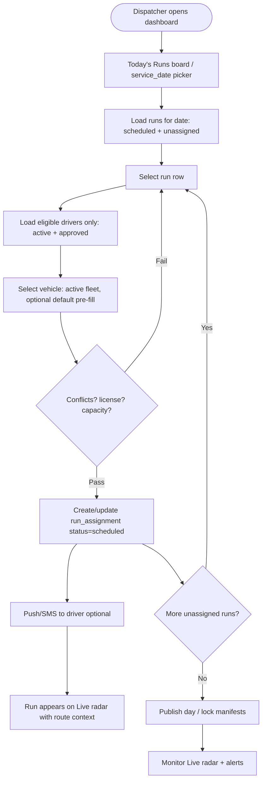
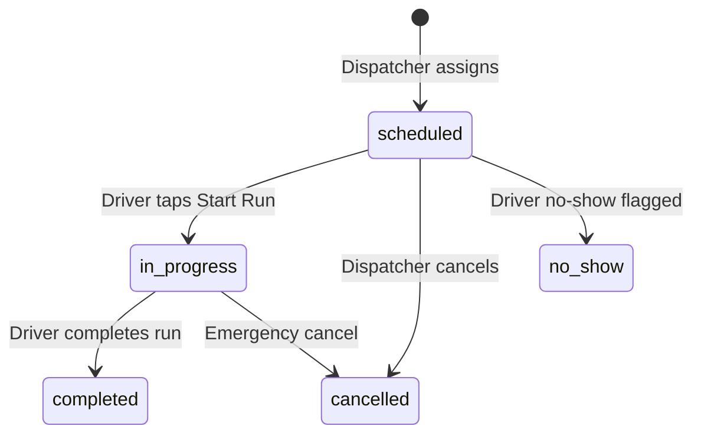
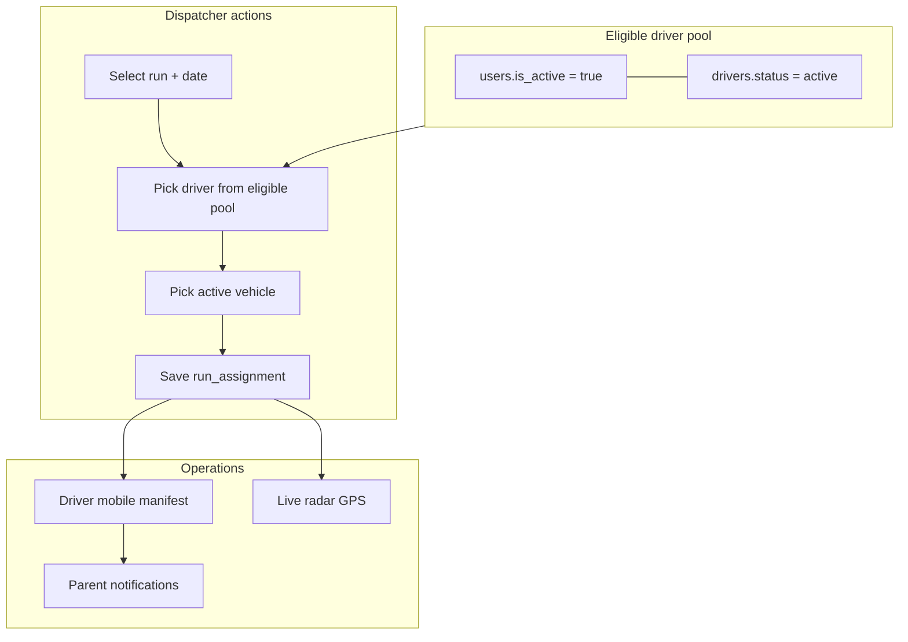

# Dispatcher — Ride Dispatch & Driver Assignment Flow

> **Audience:** Dispatchers (and admins who dispatch)  
> **Scope:** How a scheduled **run** (ride) moves from the plan to a **driver + vehicle** for a specific **service date**, and who may be assigned.

---

## 1. Product context (dispatcher dashboard today)

FleetPilot separates **long-term setup** from **daily dispatch**:

| Layer | What it is | Where dispatchers work today |
|-------|------------|------------------------------|
| **Master data** | Routes, runs (templates), drivers, vehicles, students | `/dashboard/routes`, `/dashboard/drivers`, `/dashboard/vehicles`, `/dashboard/students` |
| **Standing assignments** | Default driver↔vehicle, student↔driver | Drivers & Vehicles pages (assignment pickers) |
| **Daily dispatch** | Who drives **which run on which date** | **Planned** — `run_assignments` table exists; full UI/API not built yet |
| **Live ops** | GPS, speed, route context | `/dashboard/radar` (Live radar) |

A **ride** in dispatch terms = one **run** on one **service date**, executed as a **run assignment**.

```
Route (e.g. "Lincoln AM")
  └── Run (e.g. "LES am Run 1", 7:00–8:10, to_school)
        └── RunAssignment (service_date = today, driver + vehicle + status)
              └── RunEvents (start, stops, delay, complete) → driver mobile app
```

---

## 2. Who can be assigned? (Approved + active drivers only)

Assignment pickers must **never** list drivers who cannot legally or operationally take a run.

### Eligibility gate (all must pass)

| Check | Table / field | Rule |
|-------|---------------|------|
| Account approved | `users.is_active` | `true` — admin/dispatcher activated login after signup review |
| Account exists | `drivers.user_id` | Linked portal user (employee/contractor driver) |
| Employment active | `drivers.status` | `'active'` only — exclude `inactive`, `on_leave`, `terminated` |
| Org scope | `drivers.organization_id` | Same org as dispatcher |
| Role | `users.role` | `'driver'` (or contractor driver per org policy) |

### Recommended readiness checks (warn, optional hard block)

| Check | Field | Suggested UX |
|-------|-------|--------------|
| Default vehicle | `drivers.default_vehicle_id` | Warn if missing; pre-fill vehicle on assign |
| License valid | `drivers.license_expiry` | Warn if expired or within 30 days |
| Medical cert | `drivers.medical_cert_expiry` | Warn for CDL drivers |
| Vehicle active | `vehicles.status` | Only offer `active` vehicles |
| No double-book | `run_assignments` same date | Block if driver or vehicle already on overlapping run |

### SQL-style filter (reference for API)

```sql
SELECT d.*
FROM drivers d
INNER JOIN users u ON u.id = d.user_id
WHERE d.organization_id = :org_id
  AND d.status = 'active'
  AND u.is_active = true
  AND u.role = 'driver'
ORDER BY d.last_name, d.first_name;
```

**Signup path:** Self-registered drivers start as `users.is_active = false` and `drivers.status = inactive` until an admin approves the user **and** sets driver status to `active`.

---

## 3. End-to-end dispatch flow (target)

### Phase A — Before the dispatch day (planning)



1. Admin/dispatcher maintains **routes** and **runs** (time windows, direction, school).
2. Stops and student-stop assignments define **who is on each run**.
3. Drivers complete onboarding → admin **activates user** + sets **driver status = active**.
4. Dispatcher sets **default vehicle** per driver (master assignment).

### Phase B — Dispatch day (dispatcher morning)



**Step-by-step (dispatcher UX):**

| Step | Action | System |
|------|--------|--------|
| 1 | Open **Today's Runs** (or Dashboard → runs for date) | `GET /dashboard/runs/today?date=YYYY-MM-DD` |
| 2 | See each run: route name, time, school, assignment status, driver, vehicle | Join `runs` + `routes` + `run_assignments` |
| 3 | Click **Assign** on an unassigned or draft row | Opens assignment drawer |
| 4 | **Driver dropdown** — only eligible drivers (see §2) | `GET /drivers?dispatch_eligible=1` |
| 5 | **Vehicle dropdown** — active vehicles; pre-select driver's default | `GET /vehicles?status=active` |
| 6 | Confirm **service date** (default today) | |
| 7 | Save | `POST /runs/{run_id}/assign` → `run_assignments` row |
| 8 | Optional: assign aide (`aide_id`) for SPED runs | Same payload |
| 9 | Repeat until all critical AM runs assigned | |
| 10 | **Publish** (optional milestone) — drivers see final manifest | Status stays `scheduled`; notify driver app |
| 11 | Switch to **Live radar** during service | `GET /fleet/live` reads assignments + GPS |

### Phase C — Driver execution (mobile)



| Status | Meaning |
|--------|---------|
| `scheduled` | Assigned; not started |
| `in_progress` | Driver started; GPS active |
| `completed` | Run finished |
| `cancelled` | Dispatch cancelled assignment |
| `no_show` | Driver did not start |

Driver app: `GET /driver/today` → only assignments for that driver where user is active.

### Phase D — PM / next day

- Repeat assignment for PM runs (may be same or different driver/vehicle).
- Copy previous day assignments (future feature) for stable routes.
- On-demand / field trips: approve request → create run → assign eligible driver.

---

## 4. Assignment decision rules

### Driver selection priority (suggested)

1. Driver already on **student ↔ driver** standing assignment for students on that run.
2. Driver with **default vehicle** matching required capacity (wheelchair, SPED).
3. Driver with **no other assignment** overlapping run window on same date.
4. Remaining eligible drivers sorted by name or seniority.

### Vehicle selection

- Type must match route need (bus vs van vs wheelchair_van).
- `capacity >=` students on run.
- `vehicles.status = active`.
- Not assigned to another overlapping run same date.

### Conflict detection (required before save)

```
Same service_date:
  - driver_id already on another run_assignment where times overlap → BLOCK
  - vehicle_id already on another run_assignment where times overlap → BLOCK
```

Overlap = run A `[start, end]` intersects run B `[start, end]` (use `scheduled_start_time` / `scheduled_end_time` on `runs`).

---

## 5. Dispatcher dashboard map (current → target)

| Screen | Path today | Target capability |
|--------|------------|-------------------|
| Home KPIs | `/dashboard` | + “Unassigned runs today” card |
| **Today's Runs board** | *Not built* | **Primary dispatch screen** |
| Routes | `/dashboard/routes` | Edit runs; link to assign |
| Drivers | `/dashboard/drivers` | Approve/active status; default vehicle |
| Vehicles | `/dashboard/vehicles` | Fleet status |
| Live radar | `/dashboard/radar` | After assign — live map |
| Users | Admin only | Toggle `is_active` for driver approval |

---

## 6. API contract (target)

### List eligible drivers (assignment picker)

```
GET /api/v1/drivers?dispatch_eligible=1&per_page=100
```

Response: drivers where `status=active` AND linked `user.is_active=true`.

### Assign run for date

```
POST /api/v1/runs/{run_id}/assign
```

```json
{
  "service_date": "2026-06-09",
  "driver_id": "uuid",
  "vehicle_id": "uuid",
  "aide_id": null,
  "notes": "Covering for J. Smith"
}
```

Validation:

- 422 if driver not eligible
- 422 if vehicle not active
- 409 if driver/vehicle conflict
- Upsert if assignment already exists for `(run_id, service_date)`

### Today's board

```
GET /api/v1/dashboard/runs/today?date=2026-06-09
```

Returns runs with nested assignment, driver name, vehicle number, status.

**Implementation status:** Spec in `docs/03_API_SPECIFICATION.md`; Laravel routes not registered yet. Demo data seeds assignments in `DemoDataSeeder::seedRunAssignments`.

---

## 7. Permissions (RBAC)

| Permission | Dispatcher needs |
|------------|------------------|
| `routes.view` | See runs |
| `runs.assign` | Create/update run assignments |
| `drivers.view` | Eligible driver list |
| `vehicles.view` | Vehicle picker |
| `vehicles.view` + radar | Live ops |

Seed gap: add `runs.assign` to dispatcher role when API is implemented.

---

## 8. Notifications (after assign)

| Event | Recipient | Channel |
|-------|-----------|---------|
| Run assigned | Driver | Push + in-app |
| Run reassigned | Old + new driver | Push |
| Run cancelled | Driver | Push |
| Day published | All drivers with assignments | Push (batch) |

Templates: `docs/planning/notification_templates.md`.

---

## 9. Summary diagram (one page)



---

## 10. Implementation checklist (engineering)

- [ ] `GET /drivers?dispatch_eligible=1` with user join + filters
- [ ] `RunController` + `POST /runs/{id}/assign` with conflict checks
- [ ] `GET /dashboard/runs/today`
- [ ] Web: **Today's Runs** page with assign drawer (eligible drivers only)
- [ ] Wire `runs.assign` permission for dispatcher role
- [ ] Driver app: `/driver/today` from `run_assignments`
- [ ] Reassign / cancel flows on same board

---

*Related docs:* `docs/00_EXECUTIVE_SUMMARY.md` (§5 Operational Flow), `docs/02_DATABASE_SCHEMA.md`, `docs/03_API_SPECIFICATION.md`, `docs/planning/entity_diagram.md`.
