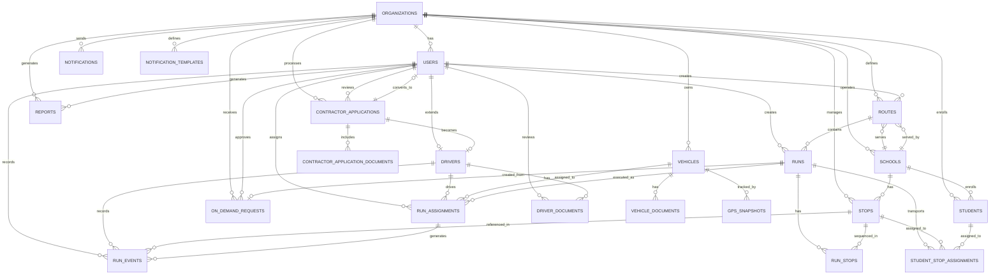
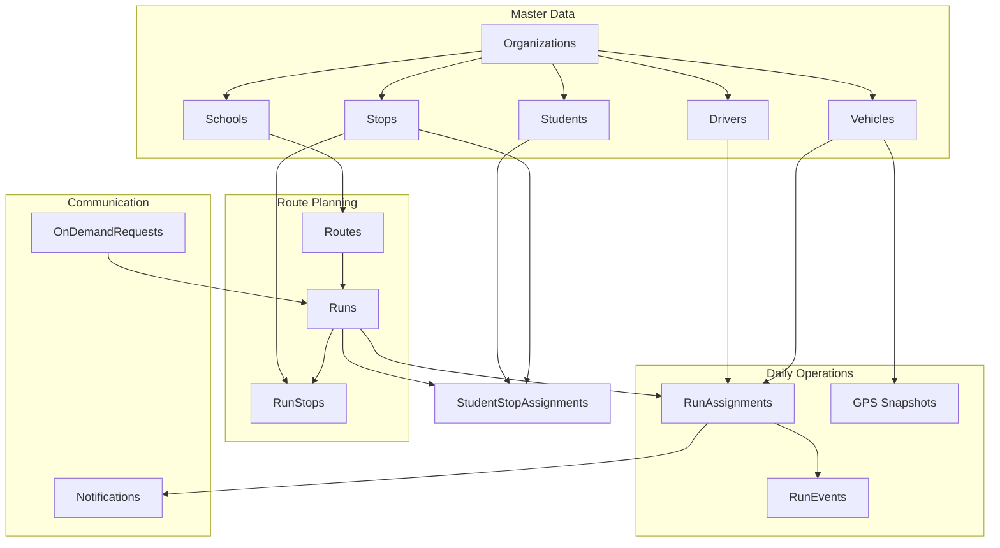

# Entity Relationship Diagram

## Visual ER Diagram (Mermaid)



---

## Table Relationship Summary

### Core Entity Groups

#### 1. Organization & Identity
```
organizations
    └── users [1:N]
        └── drivers [1:1]
            └── driver_documents [1:N]
```

#### 2. Fleet Management
```
vehicles
    ├── vehicle_documents [1:N]
    ├── run_assignments [1:N]
    └── gps_snapshots [1:N]
```

#### 3. Routing Engine
```
routes
    ├── runs [1:N]
    │   ├── run_stops [1:N] → stops [N:1]
    │   ├── run_assignments [1:N] → vehicles [N:1], drivers [N:1]
    │   ├── run_events [1:N]
    │   └── student_stop_assignments [1:N] → students [N:1]
    └── schools [N:1]
```

#### 4. Operations & Events
```
run_assignments
    └── run_events [1:N] → stops [N:1, nullable]
```

#### 5. Communication
```
notifications
    └── notification_templates [N:1]
```

#### 6. On-Demand & Contractors
```
on_demand_requests → runs [N:1, nullable]
contractor_applications
    ├── contractor_application_documents [1:N]
    └── users/drivers [1:1, on approval]
```

---

## Key Relationship Rules

| Parent | Child | Cardinality | Cascade |
|--------|-------|-------------|---------|
| organizations | users | 1:N | DELETE CASCADE |
| organizations | schools | 1:N | DELETE CASCADE |
| organizations | vehicles | 1:N | DELETE CASCADE |
| organizations | stops | 1:N | DELETE CASCADE |
| organizations | routes | 1:N | DELETE CASCADE |
| users | drivers | 1:1 | DELETE CASCADE |
| drivers | driver_documents | 1:N | DELETE CASCADE |
| vehicles | vehicle_documents | 1:N | DELETE CASCADE |
| schools | stops | 1:N | SET NULL |
| schools | routes | 1:N | SET NULL |
| schools | students | 1:N | SET NULL |
| routes | runs | 1:N | DELETE CASCADE |
| runs | run_stops | 1:N | DELETE CASCADE |
| runs | run_assignments | 1:N | DELETE CASCADE |
| runs | student_stop_assignments | 1:N | DELETE CASCADE |
| stops | run_stops | 1:N | DELETE CASCADE |
| stops | run_events | 1:N | SET NULL |
| stops | student_stop_assignments | 1:N | DELETE CASCADE |
| run_assignments | run_events | 1:N | DELETE CASCADE |
| students | student_stop_assignments | 1:N | DELETE CASCADE |
| vehicles | run_assignments | 1:N | SET NULL |
| drivers | run_assignments | 1:N | SET NULL |
| drivers | run_events | 1:N | SET NULL |
| users | run_events | 1:N | SET NULL |
| users | driver_documents | 1:N | SET NULL |

---

## Critical Constraints

### Uniqueness
- `(organization_id, code)` on `routes`
- `(organization_id, vehicle_number)` on `vehicles`
- `(run_id, assignment_date)` on `run_assignments`
- `(run_id, sequence_order)` on `run_stops`
- `(organization_id, key)` on `notification_templates`

### Foreign Key Behaviors
- **CASCADE:** Deleting an organization wipes all related data (intentional for tenant isolation).
- **SET NULL:** Deleting a school keeps stops/routes/students but removes the link.
- **RESTRICT:** Not used in MVP; all deletions are soft via status flags.

---

## Data Flow Diagram



---

*Generated for K-12 Transportation MVP | 2026-06-05*
